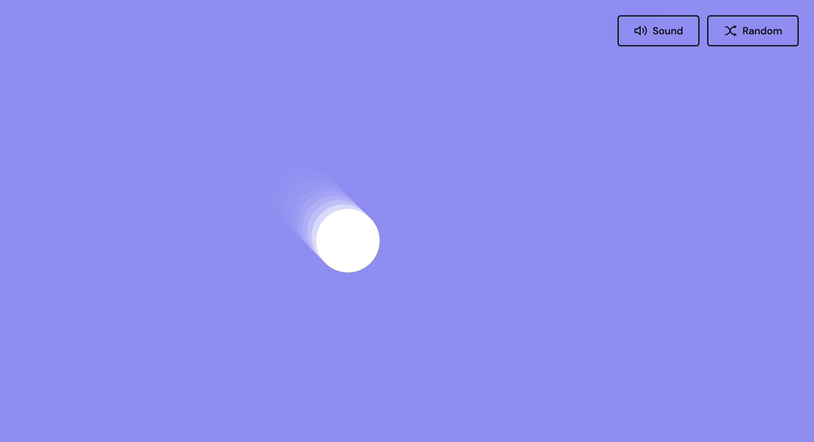
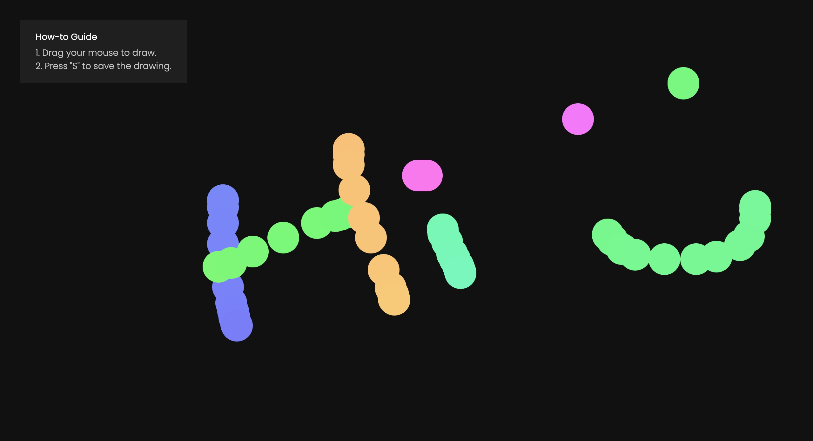
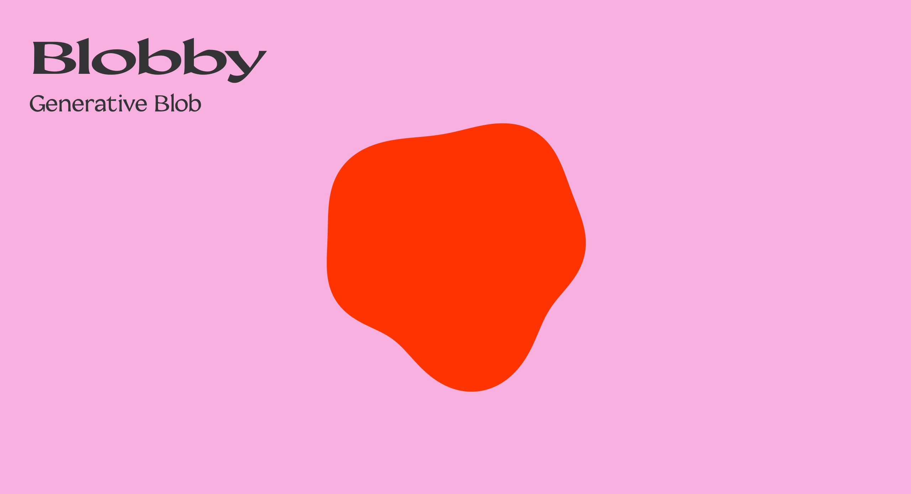
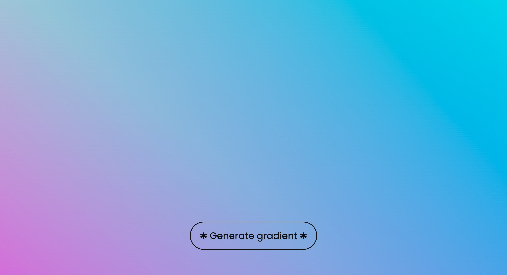
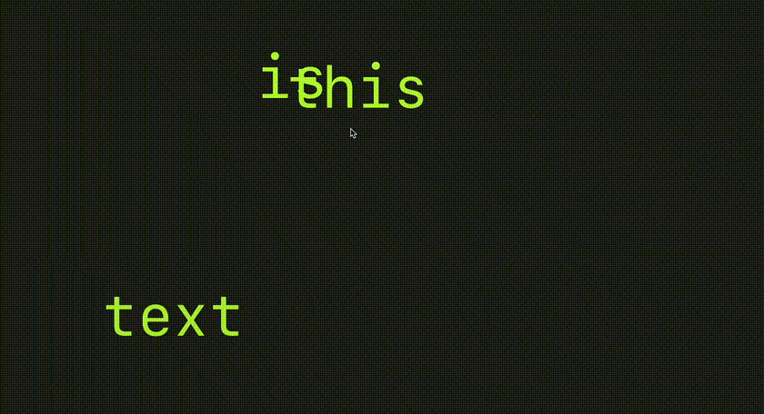
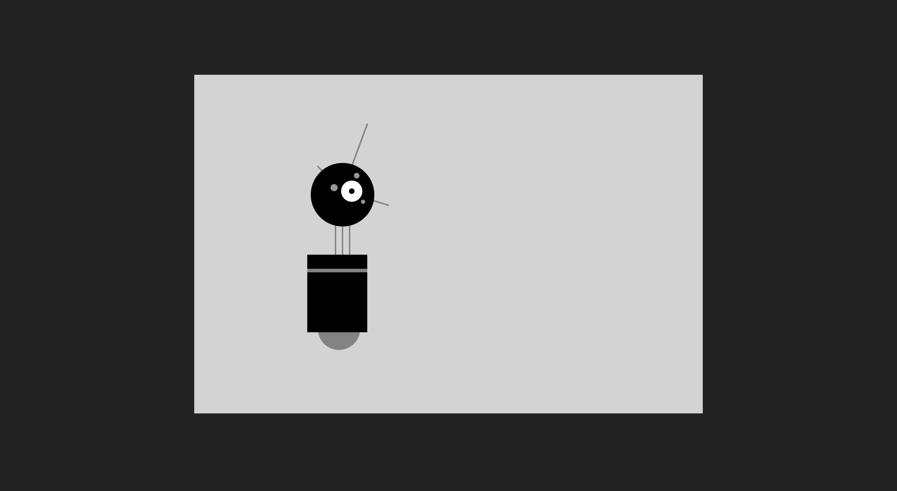

# Creative Web

### 01 Bouncy Ball



- Drawing with [p5.js](https://p5js.org/)
- Sound effects from [Tunetank](https://tunetank.com/)

### 02 Rainbow Brush



- Drag mouse to draw on canvas
- Save the drawing as jpg file

### 03 Blobby



- Generative blob
- Font: Coconat from [Collletttivo](http://collletttivo.it/)
- Ref: [Making generative art with simple mathematics](https://www.hailpixel.com/articles/generative-art-simple-mathematics)

```
x: cos
y: sin
movement: time
```

### 04 Nice Gradient



### 06 Falling Text

- v1 


  
- v2

    

- Icon made by [Freepik](https://www.flaticon.com/authors/freepik) from [www.flaticon.com](http://www.flaticon.com/)


### 07 Robot

    

### 08 Cookie Popup

    

## Resources
- [Awesome Creative Coding](https://github.com/terkelg/awesome-creative-coding)
- [Algebra Rules](http://algebrarules.com/)
- [Math Snippets (with graphic programming in mind)](https://github.com/terkelg/math)